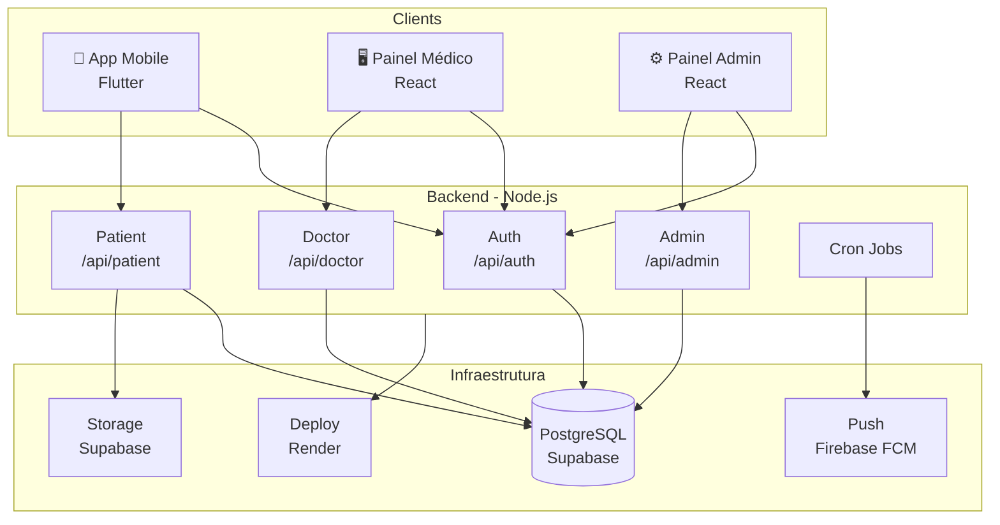

<h1 align="center">Plataforma de Acompanhamento Obstétrico — Backend API</h1>

  Node.js | Express | PostgreSQL| Supabase | GitHub Actions

  <strong>API REST para plataforma B2B2C de acompanhamento obstétrico.</strong>

> 🔒 **Nota de Portfólio:** Código privado devido a diretrizes de propriedade intelectual e viabilidade comercial. Este repositório documenta a arquitetura, decisões de engenharia e os desafios técnicos no desenvolvimento para fins de portfólio.

---

## O Produto

Plataforma digital de acompanhamento obstétrico que conecta gestantes e médicos ao longo dos 9 meses de gestação. O modelo B2B2C é vendido a clínicas e médicos autônomos, e utilizado pelas pacientes via **app mobile** e pelos médicos via **painel web**.

Três perfis com responsabilidades distintas: **gestante** acompanha sua gestação, **médico** monitora suas pacientes, **admin** gerencia conteúdo e usuários da plataforma.

---

## Arquitetura do Sistema

---

## Stack

| | |
|---|---|
| **API** | Node.js, Express |
| **Banco & Auth** | PostgreSQL, Supabase (Auth + Storage + RLS + Edge Functions) |
| **Notificações** | Firebase Admin SDK |
| **Testes** | Jest, Supertest, Docker |
| **CI/CD** | GitHub Actions, Render |

---

## Funcionalidades Implementadas

**Autenticação**
- Signup e login separados por plataforma (`/mobile`, `/web`, `/admin`) — controle de acesso server-side por role
- Refresh token, reset de senha, invalidação de sessão no logout

**Controle de Acesso**
- RBAC com três roles: `patient`, `doctor`, `admin`
- Segurança em três camadas: middleware de autorização → RLS no PostgreSQL → filtragem de campos por role no controller

**Gestações**
- CRUD completo com campos editáveis por role — paciente edita dados pessoais, médico edita dados clínicos (DPP, anotações)
- Modelagem separada entre perfil da paciente e gestação, suportando histórico de múltiplas gestações

**Artigos**
- Catálogo por categorias com busca, favoritos e marcação de lidos
- Artigo semanal dinâmico baseado na semana gestacional calculada a partir da DUM

**Diário**
- Registro semanal com status emocional e upload de fotos via Supabase Storage
- Bucket privado com URLs assinadas de curta duração

**Notificações**
- Notificações internas por tipo (`appointment_reminder`, `new_mother_note`, `vitamin_reminder`...)
- Push notifications via Firebase FCM com limpeza automática de tokens inválidos
- Cron jobs para lembretes de consulta, vitaminas e virada de semana gestacional
